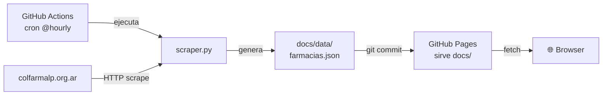

# FarmaGuardia LP

App single-page que muestra las farmacias de turno en La Plata (Argentina)
con mapa interactivo. Los datos se scrapean desde
[colfarmalp.org.ar/turnos-la-plata](https://www.colfarmalp.org.ar/turnos-la-plata/)
y se sirven como sitio **100% estático** — sin backend en producción.

Pensada para usarse tanto en desktop como en el celular (responsive real, no
"mobile = apretar todo y rezar").

## Características

- **Mapa interactivo** con pins color-codeados por zona (La Plata / Norte /
  Los Hornos).
- **Filtros** por zona y búsqueda libre por nombre o calle.
- **Sincronización mapa ↔ lista**: tocar una tarjeta centra el mapa; tocar un
  pin resalta la tarjeta.
- **Geolocalización opcional** (off por defecto). Al activarla:
  - Muestra tu posición en el mapa con un círculo de precisión.
  - Calcula y muestra la distancia a cada farmacia.
  - Ordena la lista por cercanía.
  - Si ya está activa, un tap centra el mapa en tu ubicación.
  - Long-press sobre el botón la desactiva.
- **Mobile**: el panel de farmacias es un bottom-sheet arrastrable con 3
  estados (expanded / peek / hidden), igual que apps de mapas nativas.

## Cómo funciona

El sitio del Colegio de Farmacéuticos **no tiene CORS** habilitado, así que
no se puede scrapear directo desde el browser. La solución es hacerlo en
**build time** en vez de runtime:



Cada hora un workflow corre el scraper, commitea el JSON actualizado, y
GitHub Pages lo sirve junto con el frontend estático. El browser hace
`fetch('data/farmacias.json')` y listo — sin servidor, sin CORS, gratis.

## Estructura

```
farmaguardia/
├── scraper.py                      # Lógica de scraping (pura, sin server)
├── app.py                          # Server local + CLI (solo dev / dump)
├── requirements.txt
├── README.md
├── .github/workflows/scrape.yml    # Cron de scraping cada hora
└── docs/                           # ← lo que sirve GitHub Pages
    ├── index.html
    ├── styles.css
    ├── app.js
    └── data/
        ├── .gitkeep
        └── farmacias.json          # generado por el workflow
```

## Deploy en GitHub Pages

1. **Settings → Pages**: source = `Deploy from a branch`, branch = `main`,
   folder = **`/docs`** → Save.
2. **Settings → Actions → General → Workflow permissions**: marcá
   **"Read and write permissions"** (sin esto, el workflow no puede commitear
   el JSON).
3. **Actions → "Scrape farmacias" → Run workflow** para generar el JSON
   inicial (o esperá a la próxima corrida del cron).

El workflow vive en `.github/workflows/scrape.yml`.

### Gotchas que ya están resueltos

Si copiás este patrón para otro proyecto, ojo con estos detalles que me
hicieron perder un rato:

- **Rutas relativas en el HTML** (`href="styles.css"`, no `href="/styles.css"`).
  Las absolutas rompen si servís desde un subpath tipo
  `usuario.github.io/proyecto/` o desde un dominio custom con subdirectorio.
- **`docs/data/` tiene que existir** antes de que corra `--dump`, porque
  `Path.write_text()` no crea carpetas padre. Resuelto con un `.gitkeep`
  + `Path(path).parent.mkdir(parents=True, exist_ok=True)` en `_dump_to_file`.
- **Permisos del workflow**: por default los Actions tienen permisos
  read-only. Sin el toggle de "Read and write" el job corre verde pero el
  commit nunca llega al repo.

## Desarrollo local

Para iterar sobre el frontend o el scraper con datos en vivo, el modo
"backend local" sigue funcionando:

```bash
pip install -r requirements.txt
python app.py
```

Levanta un servidor en `http://localhost:8000` que sirve el frontend desde
`docs/` y expone `/api/farmacias` con cache de 5 min. Cambios al HTML/CSS/JS
se ven con un refresh.

### Opciones de CLI

```bash
python app.py --port 9000                       # cambiar puerto
python app.py --host 0.0.0.0                    # accesible desde la LAN
python app.py --no-browser                      # no abrir navegador
python app.py --dump docs/data/farmacias.json   # solo scrapear a JSON
```

El último es el que usa el workflow de Actions — podés correrlo local para
testear el scraper sin levantar el server.

### Usar desde el celular en la misma red

```bash
python app.py --host 0.0.0.0
```

Después, desde el celular, abrí `http://<ip-de-tu-compu>:8000`.

**Nota sobre geolocalización en LAN**: `navigator.geolocation` solo funciona
sobre `http://localhost` o conexiones `https://`. Si querés usar
geolocalización desde el celular en LAN, necesitás exponerlo por HTTPS
(p. ej. con `ngrok http 8000` o `tailscale funnel`). En producción esto no
es problema porque GitHub Pages ya sirve por HTTPS.

## Usar el scraper como librería

```python
from scraper import Scraper

sc = Scraper(cache_seconds=300)
result = sc.get()
for p in result.pharmacies:
    print(p.name, p.address, p.lat, p.lng)
```

## Sobre el scraping

Ver `scraper.py`. Se parsea con BeautifulSoup usando los selectores:

- `.content.farmacias h1 > span` → timestamp publicado
- `.turnos > .tr` (excluyendo los de `.thead`) → cada fila
  - `.td[0..3]` → nombre, dirección, zona, teléfono
  - `.td[4] a[href]` → URL de Google Maps con `?destination=lat,lng`
- `.turneros a[href$='.pdf']` → PDFs del turnero por zona

Si el sitio cambia su estructura HTML, ajustá los selectores en
`scraper.py` (función `parse_html`).

## Licencia

Uso libre. Respetá los términos del sitio scrapeado; el cron horario está
justamente para no martillar a `colfarmalp.org.ar`.
