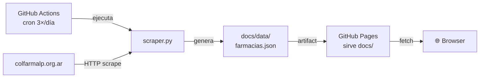

# FarmaGuardia LP

App single-page que muestra las farmacias de turno en La Plata (Argentina)
con mapa interactivo. Los datos se scrapean desde
[colfarmalp.org.ar/turnos-la-plata](https://www.colfarmalp.org.ar/turnos-la-plata/)
y se sirven como sitio **100% estático** — sin backend en producción.

## Características

- **Mapa interactivo** con pins color-codeados por zona (La Plata / Norte /
  Los Hornos); los chips de filtro hacen de referencia de colores.
- **Filtros** por zona y búsqueda libre por nombre o calle.
- **Sincronización mapa ↔ lista**: tocar una tarjeta centra el mapa; tocar un
  pin resalta la tarjeta.
- **Geolocalización opcional** (off por defecto). Al activarla:
  - Muestra tu posición en el mapa con un círculo de precisión.
  - Calcula y muestra la distancia a cada farmacia.
  - Ordena la lista por cercanía.
  - Si ya está activa, un tap centra el mapa en tu ubicación.
  - Long-press sobre el botón la desactiva.
- **Navegación tipo GPS** hasta la farmacia más cercana, con la ruta dibujada
  sobre el mapa y recálculo automático (ver abajo).
- **Bottom-sheet** en mobile con 3 estados (expanded / peek / hidden),
  arrastrable con el dedo. El alto del estado "peek" se mide en runtime a
  partir del bloque de stats + filtros, así nunca corta los chips de zona.
- **Sin botón de refrescar**: el JSON cambia 3 veces por día, así que la app
  lo recarga sola al volver a la pestaña si pasaron más de 15 minutos.

## Navegación

Con la ubicación activa se traza sola una ruta caminando hasta la farmacia
más cercana. El botón de la flecha en el header la prende y apaga; el botón
"Ruta" de cualquier tarjeta o popup fija un destino puntual.

La tarjeta de navegación son tres líneas —destino / distancia + ETA /
próxima maniobra— y toda la tarjeta es el botón de "centrar la ruta". Cuando
hay un destino fijado a mano aparece un chip "más cercana" para volver al
modo automático.

La ruta se reajusta en tres situaciones distintas:

| Situación | Qué pasa |
|---|---|
| Avanzás sobre la ruta | Se recorta el tramo recorrido y se actualizan distancia, ETA y próxima maniobra. Sin pedidos de red. |
| Te desviás más de 45 m | Se pide una ruta nueva desde donde estás. |
| Otra farmacia queda más cerca | Cambia el destino y se recalcula. También cuando cambian los filtros o llegan datos nuevos. |

El cambio de destino tiene histéresis (la nueva candidata tiene que estar un
20% y al menos 80 m más cerca): sin eso, dos farmacias casi equidistantes se
turnarían el primer puesto con cada rebote del GPS. La lista de farmacias se
reordena por cercanía con el mismo watcher de posición.

### Ruteo

Se rutea contra instancias públicas de **OSRM**, sin API key ni build step:

1. `routing.openstreetmap.de/routed-foot` — perfil peatonal (FOSSGIS).
2. `router.project-osrm.org` — perfil auto, solo de backup. Con este perfil la
   ETA se recalcula a paso de peatón (1.35 m/s) en vez de usar la que
   devuelve OSRM.
3. Si las dos fallan, se dibuja la línea recta al destino, marcada como
   aproximada en la tarjeta.

Las dos hablan la misma API v5, así que el parseo es el mismo. Son servicios
comunitarios gratuitos: hay un cooldown de 8 s entre pedidos y, mientras sigas
sobre la ruta, el avance se calcula localmente proyectando tu posición sobre
la polilínea — no se le pide nada al router. Las constantes están todas
juntas en `NAV` (arriba de `docs/app.js`).

## Cómo funciona

El sitio del Colegio de Farmacéuticos **no tiene CORS** habilitado, así que
no se puede scrapear directo desde el browser. La solución es hacerlo en
**build time** en vez de runtime:


```mermaid
flowchart LR
    A[colfarmalp.org.ar]
    B[scraper.py]
    C[GitHub Actions<br/>cron 3×/día]
    D[docs/data/<br/>farmacias.json]
    E[GitHub Pages<br/>sirve docs/]
    F[🌐 Browser]

    C -->|ejecuta| B
    A -->|HTTP scrape| B
    B -->|genera| D
    D -->|artifact| E
    E -->|fetch| F
```

Un workflow corre el scraper y publica `docs/` en Pages con el JSON recién
generado adentro. El browser hace `fetch('data/farmacias.json')` y listo — sin
servidor, sin CORS, gratis.

**El JSON no se versiona.** El artifact de Pages se arma desde el working tree
del runner, así que el dump viaja al deploy sin pasar por git. El dato vive sólo
en el último deploy publicado: no hay historial de turnos pasados.

### Frecuencia de scraping

El turno **empieza a las 08:30 y termina a las 08:30 del día siguiente**, así
que los datos cambian una vez por día. El cron corre 3 veces:

| UTC | Hora Argentina | Por qué |
|---|---|---|
| 11:40 | 08:40 | Arranca el turno nuevo |
| 16:40 | 13:40 | Por si el sitio publicó tarde o corrigió la lista |
| 23:40 | 20:40 | Última pasada antes de la noche |

Los minutos `:40` son a propósito: el scheduler de Actions se demora más
cuanto más cerca de la hora en punto se lo agenda.

## Estructura

```
farmaguardia/
├── scraper.py                      # Lógica de scraping (pura, sin server)
├── app.py                          # Server local + CLI (solo dev / dump)
├── requirements.txt
├── README.md
├── .github/workflows/scrape.yml    # Cron de scraping (3 corridas diarias)
└── docs/                           # ← lo que sirve GitHub Pages
    ├── index.html
    ├── styles.css
    ├── app.js
    ├── config.example.js           # plantilla de config.js (key de CARTO)
    ├── config.js                   # sin versionar: local a mano, en CI desde un secret
    └── data/
        └── farmacias.json          # generado por el workflow, sin versionar
```

## Deploy en GitHub Pages

1. **Settings → Pages**: source = **`GitHub Actions`** → Save. El build y el
   deploy los hace el workflow.
2. **Settings → Secrets and variables → Actions → New repository secret**:
   `CARTO_API_KEY` con la key de CARTO (ver [Tiles del mapa](#tiles-del-mapa)).
   Sin el secret el deploy anda igual, pero el mapa sale con marca de agua.
3. **Actions → "Scrape farmacias" → Run workflow** para publicar el sitio con
   datos frescos (o esperá a la próxima corrida del cron).

### Tiles del mapa

El mapa usa los tiles raster de CARTO (Voyager), que
[piden API key](https://carto.com/basemaps/apikey/). Como el repo es público,
la key **no se versiona**: `app.js` la lee de `window.FARMAGUARDIA_CONFIG`,
que define `docs/config.js` (en `.gitignore`).

- **En producción** el workflow escribe `docs/config.js` desde el secret
  `CARTO_API_KEY` antes de subir el artifact, igual que hace con el JSON.
- **En local** copiá `docs/config.example.js` a `docs/config.js` y pegá la key.
- **Sin `config.js`** el `<script>` da 404, `CARTO_KEY` queda vacía y los tiles
  se piden sin key: salen con la marca de agua "API KEY REQUIRED", pero la
  app funciona igual.

La key igual es visible para cualquiera que mire las requests del browser (va
en la query de cada tile): lo que la protege es restringirla por dominio en el
dashboard de CARTO, no esconderla.

### Notas de implementación

Detalles del setup que explican por qué algunas cosas están como están:

- **Las rutas del HTML son relativas** (`href="styles.css"`, no
  `href="/styles.css"`). Las absolutas rompen al servir desde un subpath tipo
  `usuario.github.io/proyecto/` o desde un dominio custom con subdirectorio.
- **`docs/data/` no existe en un checkout limpio**, porque no hay nada
  versionado adentro. `_dump_to_file` la crea con
  `Path(path).parent.mkdir(parents=True, exist_ok=True)`; el workflow hace
  además un `mkdir -p` para no depender de ese detalle de `app.py`.
- **Los ids de farmacia salen de nombre + dirección**, no del índice del
  array: así el destino de la ruta y la tarjeta seleccionada sobreviven a un
  refresh de los datos aunque cambie el orden o la cantidad de farmacias.

## Desarrollo local

```bash
pip install -r requirements.txt
python app.py
```

Levanta un servidor en `http://localhost:8000` que sirve `docs/`. Cambios al
HTML/CSS/JS se ven con un refresh.

**Mapa sin marca de agua**: copiá `docs/config.example.js` a `docs/config.js`
y completá `cartoKey` (ver [Tiles del mapa](#tiles-del-mapa)).

**Qué datos ves**: los de `docs/data/farmacias.json`, igual que en producción —
el browser nunca scrapea. El archivo no viene en el clon, así que generalo con
`--dump`:

```bash
python app.py --dump docs/data/farmacias.json
```

El server además expone `/api/farmacias` (scrape en vivo, cache de 5 min,
`?fresh=1` para forzar). El frontend no lo usa: está para pegarle a mano
cuando estás tocando el scraper.

```bash
curl -s localhost:8000/api/farmacias | head -40
```

### Opciones de CLI

```bash
python app.py --port 9000                       # cambiar puerto
python app.py --host 0.0.0.0                    # accesible desde la LAN
python app.py --no-browser                      # no abrir navegador
python app.py --dump docs/data/farmacias.json   # solo scrapear a JSON
```

El último es el que usa el workflow de Actions — podés correrlo local para
testear el scraper sin levantar el server.

### Usar desde el celular en la misma red

```bash
python app.py --host 0.0.0.0
```

Después, desde el celular, abrí `http://<ip-de-tu-compu>:8000`.

**Geolocalización en LAN**: `navigator.geolocation` solo funciona sobre
`http://localhost` o conexiones `https://`. Para probar ubicación y
navegación desde el celular en LAN hay que exponerlo por HTTPS (p. ej. con
`ngrok http 8000` o `tailscale funnel`). En producción no es problema porque
GitHub Pages ya sirve por HTTPS.

## Usar el scraper como librería

```python
from scraper import Scraper

sc = Scraper(cache_seconds=300)
result = sc.get()
for p in result.pharmacies:
    print(p.name, p.address, p.lat, p.lng)
```

## Sobre el scraping

Ver `scraper.py`. Se parsea con BeautifulSoup usando los selectores:

- `.content.farmacias h1 > span` → timestamp publicado
- `.turnos > .tr` (excluyendo los de `.thead`) → cada fila
  - `.td[0..3]` → nombre, dirección, zona, teléfono
  - `.td[4] a[href]` → URL de Google Maps con `?destination=lat,lng`
- `.turneros a[href$='.pdf']` → PDFs del turnero por zona

Si el sitio cambia su estructura HTML, ajustá los selectores en
`scraper.py` (función `parse_html`).

La clave `pdfs` del JSON (los turneros mensuales por zona) queda disponible
pero el frontend todavía no la muestra: no es un bug, está a propósito.

El sitio a veces publica coordenadas rotas (`destination=0,0`, o una longitud
cargada en el campo de latitud). El frontend las filtra con un bounding box
del Gran La Plata (`LP_BOUNDS` en `docs/app.js`): esas farmacias aparecen en
la lista con un aviso, pero no en el mapa ni como destino de ruta.

## Licencia

Uso libre. Respetá los términos del sitio scrapeado y de las instancias
públicas de OSRM.
